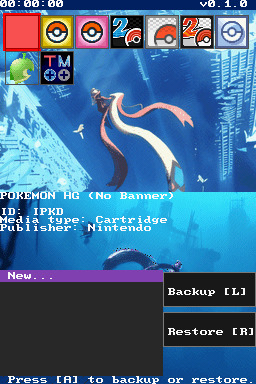

# Snapshot

Snapshot is a powerful save management tool for the Nintendo DS, inspired by the 3DS save manager **Checkpoint**. It allows users to backup and restore save data from both SD card ROMs and physical Cartridges.

## Features

- **Robust Slot-1 Support**: Fully functional backup and restore for physical cartridges (SPI EEPROM, Flash, and NAND) using the same high-reliability engine as **GodMode9i**.
- **TWiLight Menu Integration**: Automatically detects and respects TWiLight Menu save settings (`SAVE_LOCATION` and `SAVES_PATH`).
- **Enhanced Save Slot System**:
    - Manage all 10 TWiLight Menu save slots (`.sav`, `.sav1`, ..., `.sav9`) for SD games.
    - **Create new slots**: Restore any backup to an `[Empty]` slot to automatically create it.
    - Clear visual indicators for existing and empty slots in the selection menu.
- **SD & Slot-1 Scanning**: Automatically scans your SD card and the physical cartridge slot for games.
- **Hardware-Safe Writing**: Implements page-boundary safety and bit-accurate address transmission to prevent data corruption on physical chips.
- **Game Recognition**: Displays game icons and long titles extracted directly from ROM banners.
- **Custom Backups**: Create save backups with custom names or use automatic timestamps.
- **Backup Management**: Restore, rename, or delete existing backups directly from the interface.

## Technical Improvements (v0.2.0)

- **Engine Alignment**: Aligned the Low-Level save engine 1:1 with GodMode9i/libnds standards.
- **Bus Ownership**: Proper ARM9 bus management ensures stable communication with Slot-1.
- **Page-Boundary Protection**: Implemented safe-writes for SPI Flash/EEPROM (Type 1: 16b, Type 2: 32b, Type 3: 256b).
- **Path Logic**: Fixed save path construction to correctly use TWiLight Menu subfolders and proper file extensions.
- **Filtering**: Automatically hides system tools like TWiLight Menu (`SRLA`) from the game list.

## Controls

- **D-Pad**: Navigate game list and menus.
- **A**: Confirm selection / Enter game details.
- **B**: Back / Cancel.
- **L**: Create a new Backup from the selected slot.
- **R**: Restore selected Backup to the selected slot.
- **X**: Delete selected Backup.
- **Y**: Rename selected Backup.
- **START**: Confirm.
- **SELECT**: Cancel.

## Build Requirements

The project is built using the **BlocksDS** SDK and **devkitPro**.

## Credits

- **[Edo9300](https://github.com/edo9300)**: Author of the robust save writing code for cartridges in GodMode9i.
- **[RocketRobz](https://github.com/RocketRobz)**: Inspiration and reference code from **TWiLightMenu++** for reading .nds file information.
- **[devkitPro](https://github.com/devkitPro)**: For providing **devkitARM** and **libnds**, the foundation of DS development.
- **[BlocksDS](https://github.com/blocksds)**: For the modern **BlocksDS SDK** used to build this project.
